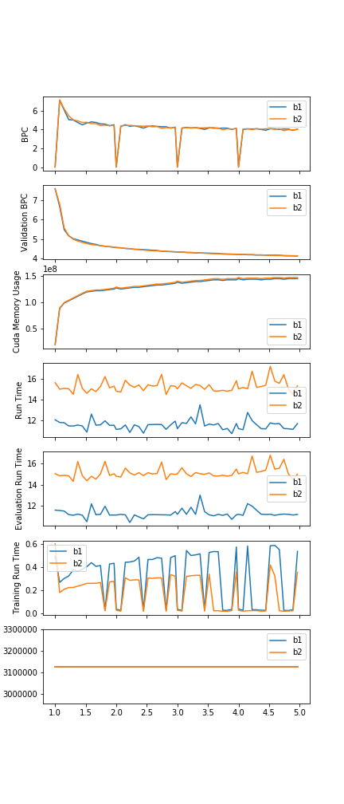
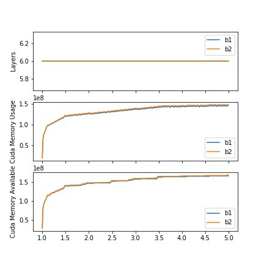

# Run on the same node of RNN-MSNN with different batch size
Test report

by E. Marquer, 2018/06/15
Synalp and Université de Lorraine

## Abstract
The test is composed of 2 runs:
- id 1583339: batch-size 1, bptt 200 on grele-2
- id 1583336: batch-size 2, bptt 100 on grele-1

Run time per epoch varies from 28 to 20 min for a single batch and from 20 to 11 min for two batches.

### Shared parameters

| parameter        | value                 |
|------------------|-----------------------|
| corpus           | enwik8reduced         |
| history_strategy | layer-constant-length |
| max_history      | 25                    |
| bptt             | *variable*            |
| batch_size       | *variable*            |
| epochs           | 4                     |
| lr               | 1e-3                  |
| weight_decay     | 1.2e-6                |
| epochs           | 4                     |
| valid_len        | 500,000               |
| log_interval     | 500                   |
| save_interval    | 500                   |
| memory_interval  | 100                   |
| hidden_size      | 460                   |
| embed_size       | 400                   |
| growth_factor    | 5                     |
| rnn_type         | RNN                   |
| reset_hidden     | False                 |
| reset_growth     | True                  |
| cuda_on          | True                  |

## Results
At the end of each epoch, we see a spike in BPC, due to the first evaluation of the epoch (BPC is reinitialised to 0, 
causing a spike).
With 2 btches, BPC is also more stable.

As of now, run time is computed after running validation, so training time is 
`real_training_time = run_time - validation_time`.
But validation time increase with the number of batches as the number of characters seen increase (the whole validation 
corpus is used for each batch, so the number of characters seen during validation is `validation_corpus_len * batches`).
That explains that the evaluation time for a batch is lower than for 2 batches.

By removing evaluation time, we can obtain a reasonable and coherent (with regard to epoch run time) estimation of
training time over a sequence.

### Epoch run time:
| Epoch | Run time b=1 | Run time b=2 |
|-------|--------------|--------------|
| 1     | 28 min       | 20 min       |
| 2     | 23 min       | 17 min       |
| 3     | 22 min       | 14 min       |
| 4     | 20 min       | 11 min       |

There is a notable decrease in epoch run time (time necessary to run over an epoch), of about 10 min over the 4 epochs,
with both runs.

Possible causes for the decrease of run time:
- part of the graph is already computed, and this part is skipped;
- corpus data is already loaded in cuda memory.

Both of them are highly unlikely to cause such a decrease.
A more precise training time storage may provide an explanation.

### Plots

## Next steps
- Data
    - Implement more precise time data saving (epoch run time and training run time)
- Runs (objective: 100 epochs)
    - Continue running batches 1 and 2
    - Try with higher number of batches
- [Optional] Other experimental branch
    1. Implement prepared attention module in every layer
    2. Analyse results
    3. Patch probable memory leaks