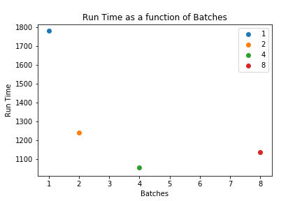

# Run over more than 50 epochs with varied batch size
Test report

by E. Marquer, 2018/06/19
Synalp and Université de Lorraine

## Abstract
The test is composed of 4 runs on grele, with:
- bptt 200, batch-size 1
- bptt 100, batch-size 2
- bptt 50, batch-size 4
- bptt 25, batch-size 8

Run has been interrupted by an overflow of disk space due to the detailed logs; next runs will used reduced logs.

Run time per epoch varies from 30 to 7 min.

### Shared parameters

| parameter        | value                 |
|------------------|-----------------------|
| corpus           | enwik8reduced         |
| history_strategy | layer-constant-length |
| max_history      | 25                    |
| bptt             | *variable*            |
| batch_size       | *variable*            |
| epochs           | 4                     |
| lr               | 1e-3                  |
| weight_decay     | 1.2e-6                |
| epochs           | 4                     |
| valid_len        | 500,000               |
| log_interval     | 500                   |
| save_interval    | 500                   |
| memory_interval  | 100                   |
| hidden_size      | 460                   |
| embed_size       | 400                   |
| growth_factor    | 5                     |
| rnn_type         | RNN                   |
| reset_hidden     | False                 |
| reset_growth     | True                  |
| cuda_on          | True                  |

## Results
At the end of each epoch, we see a spike in BPC, due to the first evaluation of the epoch (BPC is reinitialised to 0, 
causing a spike).
With any number of batch, while keeping the `bptt * batch_size` ratio, BPC and Validation BPC do not vary.

Even with 200 epochs, with batch size of 1, there is no trace of over-fitting.

### Epoch run time:
| Epoch | Run time b=1 | Run time b=2 | Run time b=4 | Run time b=8 |
|-------|--------------|--------------|--------------|--------------|
| 1     | 30 min       | 21 min       | 18 min       | 19 min       |
| 10    | 21 min       | 14 min       | 14 min       | 17 min       |
| >15   | 7 min        | 7 min        | 8 min        | 11 min       |

| Epoch 1                             | Epoch 10                             | Epoch 15                             |
|-------------------------------------|--------------------------------------|--------------------------------------|
|  |  |  |

Run time can be split over two set of epochs: before, and after the 15th epoch.
Before the 15th epoch, run is faster with more batches, with the exception of batch-size 8, which is slower than 
batch-size 2 and 4.
After the 15th epoch, run is slower with more batches.

To optimize run time, it is necessary to balance run time before 15 epochs.
If a high number of batches is planed (>50), between 2 and 4 batches are preferable, because the run time after epoch 15
has a lot of impact on global run time; however, if only a few epochs are planed (<20), a high number of batches is 
preferable, as run time before epoch 15 is the most important.

With current corpus, 2, 3 or 4 batches are the most interesting setup.

Decrease in run time is most probably due to the history of the upper layers, that needs multiple epochs to fill.

### Plots
#### BPC

#### Memory

#### Run time (in seconds)

##### Epoch run time

## Next steps
- Independent impact of batch number and sequence length:
    - Run with fixed batch number and varying sequence length
    - Run with fixed sequence length and varying batch number
- Impact of corpus length on optimal number of batch and sequences:
    - Run with varying sequence length and varying batch number over the full length corpus
- Number of parameters:
    - Increase the hidden layer size
- [Future] Transmission rate impact:
    - Compare optimal values of parameters, and BPC reached with varying transmission rate
