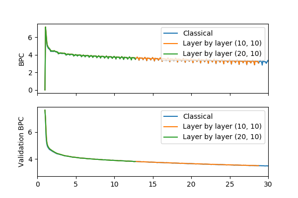

# Run over more than 50 epochs with varied batch size
Test report

by E. Marquer, 2018/06/19
Synalp and Université de Lorraine

## Abstract
The test runs are for two parallel experiments:
- test which of 2 and 3 batches are the most interesting
- test the impact of layer by layer training (with an intuitive algorithm developed out of work-time)

The test is composed of 4 runs on grele, with:
- bptt 200/2, batch-size 2
- bptt 200/3, batch-size 3
- bptt 200/2, batch-size 2, layer by layer training,
- bptt 200/2, batch-size 2, layer by layer training, 20 epochs of individual training for each layer,
 10 epochs of common fine-tuning for already trained layers (see below the explanation of this algorithm)

### Shared parameters
| parameter        | value         |
|------------------|---------------|
| corpus           | enwik8reduced |
| history_strategy | last          |
| max_history      | 25            |
| lr               | 1e-3          |
| weight_decay     | 1.2e-6        |
| epochs           | 1500          |
| valid_len        | 500,000       |
| log_interval     | 500           |
| save_interval    | 500           |
| memory_interval  | 100           |
| hidden_size      | 460           |
| embed_size       | 400           |
| growth_factor    | 5             |
| rnn_type         | RNN           |
| reset_hidden     | False         |
| reset_growth     | True          |
| cuda_on          | True          |

### Model keys and specificities
When noting is specified, all models have:

- 2 batches, and a sequence length of 200/2
- 1 RNN layer per MSNN layer  

| Model     | Specificity                                                                                                                |
|-----------|----------------------------------------------------------------------------------------------------------------------------|
| b2        | classical model, comparison basis                                                                                          |
| b3        | 3 batches, sequence length of 200/3                                                                                        |
| s         | "scheduled(10,10)": use layer by layer training; 10 epochs for individual training, 10 epochs for intermediary fine-tuning |
| s-a20-l10 | "scheduled(20,10)": use layer by layer training; 20 epochs for individual training, 10 epochs for intermediary fine-tuning |
| l2        | 2 RNN layer per MSNN layer                                                                                                 |
| l3        | 3 RNN layer per MSNN layer                                                                                                 |
| s_l3_a    | 3 RNN layer per MSNN layer, "scheduled(10,10)" (see model "s"), attentive intermediary input                               |

### Series
| Series | Model            | Respective name of models on plots                                | Objective                                                                                             |
|--------|------------------|-------------------------------------------------------------------|-------------------------------------------------------------------------------------------------------|
| b2_b3  | b2, b3           | "b2", "b3"                                                        | Compare training with 2 and 3 batches                                                                 |
| l      | b2, l2, l3       | "1 RNN layer", "2 RNN layers", "3 RNN layers"                     | See impact of number of RNN layers                                                                    |
| lbl    | b2, s, s-a20-l10 | "Classical", "Layer by layer (10, 10)", "Layer by layer (20, 10)" | See impact of layer by layer training                                                                 |
| sum    | b2, s_l3_a       | "Classical", "3 RNN layers, LbL, attentive"                       | Check if layer by layer training, atentive model, and multi-RNN-layered architectures are compatibles |

## Results
| Series | Time                         | Time to run an epoch          | Memory                         | BPC                          | Full length BPC                   |
|--------|------------------------------|-------------------------------|--------------------------------|------------------------------|-----------------------------------|
| b2_b3  |  |  |  |  |  |
| l      |      |      |      |      |      |
| lbl    |    |    |    |    |    |
| sum    |    |    |    |    |    |

Plots will be referred to with <series>:<collumn> (Ex: "l:Memory")

### Time necessary to reach indicated validation BPC
| Model     | 5 BPC       | 4 BPC       | 3 BPC       |
|-----------|------------:|------------:|------------:|
| b2        |  0H 19M 41S |  1H 19M 47S | 15H 13M  7S |
| b3        |  0H 16M 44S |  1H 11M 48S | 15H  3M 22S |
| s         |  0H  5M 19S |  0H 30M 59S |             |
| s-a20-l10 |  0H  5M 19S |  0H 30M 26S |             |
| l2        |  0H 33M 43S |  2H 27M 51S |             |
| l3        |~~0H 7M 41S~~|~~2H 13M 2S~~|             |
| s_l3_a    |  0H 16M  7S |             |             |

Empty fields are where network has not reached BPC yet
~~Crossed out~~ fields are where data has been corrupted (because of an interruption in training)

### Epochs necessary to reach indicated validation BPC
| Model     | 5 BPC | 4 BPC | 3 BPC |
|-----------|-------|-------|-------|
| b2        | 0.296 | 6.000 | 141.4 |
| b3        | 0.367 | 5.954 | 136.4 |
| s         | 0.371 | 6.000 |       |
| s-a20-l10 | 0.371 | 6.000 |       |
| l2        | 0.593 | 6.519 |       |
| l3        | 0.816 | 7.296 |       |
| s_l3_a    | 1.148 |       |       |

Empty fields are where network has not reached BPC yet

## Analysis
### Run time and memory on "l" series (l:memory, l:time, and l:time to run an epoch)
Training of "l3" model was interrupted 2 times before the 15th epoch, each time cleaning the memory, inducing training
time reduction and epoch time reduction (due to the correlation of memory usage and training time).

### Run time and memory on "lbl" series (lbl:memory, lbl:time, and lbl:time to run an epoch)
The specificity of layer by layer training are a lead to the cause of the collapse of memory usage and run time during
the 15th epoch.

During layer by layer training, memory usage is kept constant over the first 15 epochs, whereas with classical training,
memory usage increases during ths period.

Layer by layer training reduces simultaneous graph accumulation over the different epochs by training a layer at a time.
It possibly reduces SGD inertia too.

### Performance of layer by layer training
No notable variation on BPC. For run time and memory, see above.

### Performance of multi-RNN-layered architecture
A slight improvement of BPC can be seen with 3 layers (sadly, BPC data for 2 layers is corrupted).
Computation-time is proportional to the number of layers (time data for 3 layers is unusable).

### Performance of 3 batches compared to 2 batches
2 and 3 batches have an almost identical performance (time-wise, BPC-wise and memory-wise), except 3 batches seem to get
less dispersed BPC.

### Results of long training with 2 and 3 batches (b2_b3:full length bpc)
The plot "b2_b3:full length bpc" shows that after 200 epochs, validation BPC stagnates.
After 300 epochs, validation BPC begins to increase very slowly, those are the first signs of over-fitting.
These observations were cross-checked with the raw data.

### Note on attention module
A model with the attention module was tested for 5 hours, and did not reach a full epoch. It can be deemed that without
a training algorithm like layer by layer training, using attention is not viable.
